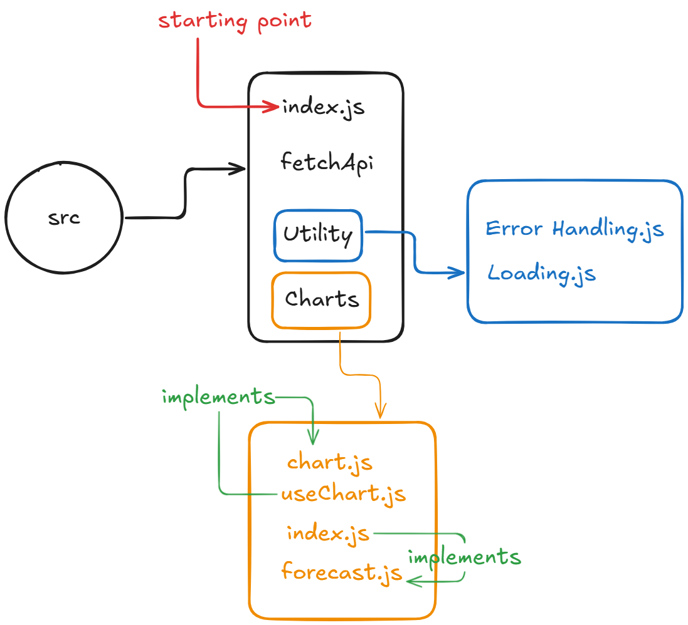

# Weather_CLI 🌦️
A robust, feature-rich command-line interface (CLI) tool built with Node.js that allows users to fetch real-time weather data and visualize forecasts directly from their terminal.



## Key Features

* **Robust CLI Architecture:** Built using the [Commander.js](https://www.npmjs.com/package/commander) library for seamless command parsing, argument handling, and help generation.
* **Custom Error Handling:** Implements a dedicated `withErrorHandling` utility wrapper to ensure the application fails gracefully and provides meaningful feedback during API outages or invalid inputs.
* **Asynchronous Operations:** Fully utilizes ES6 `Async/Await` patterns for non-blocking data fetching.
* **Interactive UX:** Features a **Custom Loading Spinner** to provide visual feedback while fetching data from remote APIs.
* **Data Visualization:** Includes charting capabilities to visualize hourly forecasts and summaries (via the `chart` command).

---

## 🛠️ Prerequisites

Before running this project, ensure you have the following installed:

* **Node.js** (v14 or higher recommended)
* **npm** (Node Package Manager)

You will also need an API Key from **[WeatherAPI.com](https://www.weatherapi.com/)** (based on the endpoint structure used in the project).

---

## 📥 Installation

1. **Clone the repository:**
```bash
git clone https://github.com/karthik-provus/Weather_CLI.git
cd Weather_CLI

```


2. **Install dependencies:**
```bash
npm install

```


3. **Environment Setup:**
Create a `.env` file in the root directory and add your API base URL (and key if required by your specific implementation logic, usually strictly the base URL or key is stored here):
```env
WEATHER_API=http://api.weatherapi.com/v1
# Ensure your FetchApi.js logic handles the API Key appending, 
# or add a specific key variable here if your code expects it.

```


---

## 💻 Usage

Run the application using the `node` command pointing to the source entry file.

### General Syntax

```bash
node src/index.js <command> [arguments] [options]

```

### 1. Check Current Weather (`current`)

Get the current weather conditions for a specific city.

* **Basic Usage:**
```bash
node src/index.js current "New York"

```


* **Options:**
* `-f, --fahrenheit`: Get temperature in Fahrenheit.
* `-d, --detailed`: Get detailed metrics (Feels like, Condition, Max/Min/Avg for the day).


* **Example (Detailed view in Fahrenheit):**
```bash
node src/index.js current London -d -f

```


### 2. Visualize Forecast (`chart`)

Generate visual charts and summaries for weather forecasts.

* **Basic Usage:**
```bash
node src/index.js chart "Tokyo"

```


* **Options:**
* `-s, --forecastSummary`: Display a text summary of the forecast.
* `-T, --hourlyForecast`: Generate an hourly chart visualization.
* `-f, --Fahrenheit`: Use Fahrenheit for the data.


* **Example (Hourly chart):**
```bash
node src/index.js chart Paris --hourlyForecast

```


---

## 📂 Project Structure

```text
Weather_CLI/
├── src/
│   ├── Charts/           # Logic for generating weather charts
│   ├── Utility/          # Helper functions (ErrorHandling.js)
│   ├── FetchApi.js       # API communication logic
│   └── index.js          # Entry point (Commander logic)
├── .env                  # Environment variables
├── package.json
└── README.md

```
